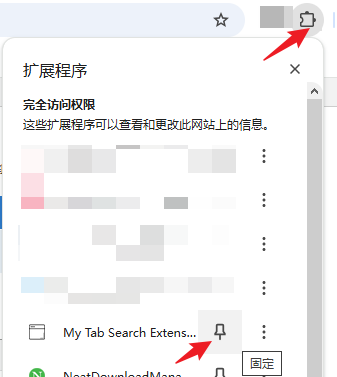

# my-tab-search

## Description
A Chrome browser tab management extension that supports quick search by keywords and switching to the corresponding tabs. Supports using up/down arrow keys to switch selected tab entries, and pressing Enter to confirm navigation to the target page.

## Features

- Search and filter tabs based on title.
- Quick access to relevant tabs.
- Keyboard shortcut support for easy toggling.
- Supporting to switch the selected tab entry by using the up and down arrow key.
- Support keyboard press Delete key to remove selected tab entry.

## Installation

1. Clone or download this repository.
2. Open Google Chrome.
3. Navigate to `chrome://extensions/`.
4. Enable "Developer mode" at the top-right corner.
5. Click on "Load unpacked" and select the extension directory.

## Usage

- Open the extension popup by clicking on the extension icon in the Chrome toolbar or use the default keyboard shortcut(Crtl + Shift + A , prefered!).
- Enter your search query in the input field to filter tabs.
- Click on a tab in the list Or press Up or Down arrow keys to select the target item and press Enter button to switch to it.

## Keyboard Shortcut

1. The shortcut key to invoke the tab list is `Ctrl+Shift+A`
2. The shortcut key to quickly switch to the previous opened tab is Ctrl+Shift+S (since 1.6.0)
3. If you find the default shortcuts not working, there might be key conflicts. You can adjust them at 【chrome://extensions/shortcuts】.
4. For smoother usage, it's recommended to pin the extension directly to the browser panel after installation.

## License

This project is licensed under the MIT License - see the [LICENSE](LICENSE) file for details.

## Author

dongft

## Acknowledgments

- Icons are from www.pngsucai.com.

## Contributing

1. Fork the repository.
2. Create a new branch (`git checkout -b feature/awesome-feature`).
3. Commit your changes (`git commit -m 'Add awesome feature'`).
4. Push to the branch (`git push origin feature/awesome-feature`).
5. Open a pull request.
