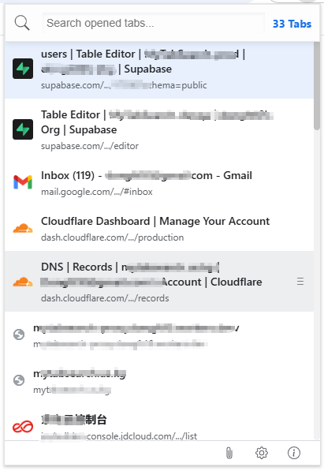
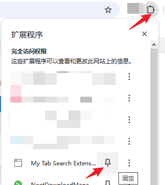

# MyTabSearch - Chrome Extension



## 项目简介

MyTabSearch 是一个高效的 Chrome 浏览器标签页管理扩展，旨在帮助用户快速搜索、切换和管理浏览器标签页，提高多标签页浏览效率。支持用户账户系统、跨设备同步固定标签页、多种搜索模式等功能。

## 在线演示

访问我们的 [GitHub Pages](https://dongft10.github.io/my-tab-search/) 查看扩展的详细介绍和功能演示。

## 功能特性

### 核心功能

- 🔍 **快速搜索**: 根据标题搜索和过滤标签页，支持多种搜索模式
- ⌨️ **键盘导航**: 支持上下方向键选择目标标签页
- ⚡ **快速切换**: 按 Enter 键快速切换到目标标签页
- 🗑️ **直接关闭**: 按 Delete 键直接关闭选中的标签页
- 🔄 **历史记录**: 支持快速切换到上一个标签页（Alt+W）
- 📌 **长期固定**: 保存常用标签页到固定列表（Alt+E），方便快速访问和管理，即使关机了也不丢失。

### 固定标签页管理

- 🟠 **固定标签页**: 保存常用的标签页，方便快速访问
- ☁️ **云端同步**: 推广期、体验期或 VIP 用户可跨设备同步固定标签页
- 🔢 **数量限制**: 
  - 匿名用户：5 个
  - 已注册用户（体验期/VIP）：100 个

### 用户账户系统

- 🔐 **多种登录方式**: 
  - Google OAuth 登录
  - Microsoft OAuth 登录
  - 邮箱验证码登录
- 👤 **账户管理**: 查看账户状态、VIP 信息、设备列表
- 💎 **VIP 会员**: 解锁更多高级功能

### 搜索模式

| 模式 | 说明 |
|------|------|
| 模式1 | 标题关键字快速匹配 |
| 模式2 | 标题子序列匹配 |
| 模式3 | 标题关键字快速匹配 + 网页内容匹配 （待实现） |
| 模式4 | 标题子序列匹配 + 网页内容匹配（待实现） |

### 其他特性

- 🌐 **国际化**: 支持中英文双语界面
- 🎨 **主题切换**: 支持浅色/深色主题
- 🏷️ **图标显示**: 显示网站图标，便于快速识别
- 💾 **状态记忆**: 记住上一个激活标签页的状态

## 安装方法

### 方法一：从 Chrome Web Store 安装（推荐）

1. 访问 [Chrome Web Store](https://chrome.google.com/webstore/detail/mytabsearch-extension/adfbidbchmbodidfjmimbkfndnenljjp)
2. 点击"添加到 Chrome"按钮
3. 完成安装

### 方法二：手动安装 CRX 文件

1. 从项目的 [Releases](../../releases) 页面下载最新的 CRX 文件
2. 打开 Chrome 浏览器，访问 `chrome://extensions/`
3. 启用右上角的"开发者模式"
4. 将 CRX 文件拖拽到浏览器中
5. 点击"添加扩展程序"完成安装

### 方法三：开发者模式加载

1. 克隆本仓库到本地
2. 打开 Chrome 浏览器，访问 `chrome://extensions/`
3. 启用右上角的"开发者模式"
4. 点击"加载已解压的扩展程序"
5. 选择本目录（chrome-extension）或 `pack/out/build/` 目录
6. 完成加载

## 使用说明

### 基本使用

1. **打开扩展**: 点击 Chrome 工具栏中的扩展图标，或使用快捷键 `Alt+Q`
2. **搜索标签页**: 在输入框中输入关键词，过滤标签页
3. **选择标签页**: 使用上下方向键或鼠标点击选择目标标签页
4. **切换标签页**: 按 Enter 键切换到选中的标签页
5. **关闭标签页**: 选中标签页后按 Delete 键关闭

### 快捷键

| 快捷键 | 功能 | 说明 |
|--------|------|------|
| `Alt+Q` | 打开搜索弹窗 | 快速呼出标签页搜索界面 |
| `Alt+W` | 切换到上一个标签页 | 快速返回上一个访问的标签页 |
| `Alt+E` | 打开固定标签页列表 | 打开已固定的标签页列表 |
| `↑` / `↓` | 导航搜索结果 | 在搜索结果中上下移动 |
| `Enter` | 切换到选中标签页 | 跳转到当前选中的标签页 |
| `Delete` | 关闭选中标签页 | 直接关闭当前选中的标签页 |

### 使用技巧

1. **固定扩展**: 安装后建议将扩展固定到浏览器工具栏，方便快速访问

   

2. **快捷键冲突**: 如果默认快捷键无效，可能是按键冲突，可以在 `chrome://extensions/shortcuts` 中调整
3. **图标识别**: 每个标签页都显示对应的网站图标，便于快速识别

## 开发指南

### 环境要求

- Node.js 16.x 或更高版本
- npm 或 yarn
- Chrome 浏览器（开发者模式）

### 安装依赖

```bash
npm install
```

### 开发模式

```bash
# 开发构建（无压缩，带环境标识）
npm run build:dev

# QA 环境构建
npm run build:qa

# 生产构建（压缩）
npm run build
```

构建完成后，在 `chrome://extensions/` 中加载 `pack/out/build/` 目录。

### 项目结构

```
chrome-extension/
├── _locales/             # 国际化语言文件
│   ├── en/               # 英文
│   └── zh_CN/            # 简体中文
├── css/                  # 样式文件
│   ├── popup.css         # 主弹窗样式
│   ├── settings.css      # 设置页面样式
│   ├── auth.css          # 认证页面样式
│   └── pinned-list.css   # 固定标签页样式
├── html/                 # HTML 页面
│   ├── popup.html        # 主弹窗页面
│   ├── settings.html     # 设置页面
│   ├── auth.html         # 认证页面
│   ├── pinned-list.html  # 固定标签页列表
│   └── about.html        # 关于页面
├── images/               # 图标和图片资源
├── js/                   # JavaScript 源代码
│   ├── api/              # API 客户端
│   │   ├── client.js           # 基础 API 客户端
│   │   ├── client-enhanced.js  # 增强版 API 客户端
│   │   └── auth.js             # 认证 API
│   ├── services/         # 业务服务
│   │   ├── auth.service.js          # 认证服务
│   │   ├── vip.service.js           # VIP 状态服务
│   │   ├── trial.service.js         # 试用期服务
│   │   ├── device.service.js        # 设备管理服务
│   │   ├── pinned-tabs.service.js   # 固定标签页服务
│   │   ├── pinned-tabs-sync.service.js # 固定标签页同步服务
│   │   ├── sync-queue.service.js    # 同步队列服务
│   │   ├── feature-limit.service.js # 功能限制服务
│   │   └── search-match.service.js  # 搜索匹配服务
│   ├── utils/            # 工具类
│   │   ├── theme.js            # 主题管理
│   │   ├── theme-early.js      # 主题早期加载
│   │   ├── theme-init.js       # 主题初始化
│   │   ├── theme-settings.js   # 主题设置
│   │   └── version-manager.js  # 版本管理
│   ├── background.js     # 后台服务（Service Worker）
│   ├── popup.js          # 主弹窗逻辑
│   ├── settings.js       # 设置页面逻辑
│   ├── auth.js           # 认证页面逻辑
│   ├── pinned-list.js    # 固定标签页列表逻辑
│   ├── about.js          # 关于页面逻辑
│   ├── i18n.js           # 国际化支持
│   ├── popup-icons.js    # 图标处理
│   └── config.js         # 配置文件
├── pack/                 # 打包工具和脚本
│   ├── scripts/          # Node.js 打包脚本
│   └── *.bat/*.ps1       # Windows 打包脚本
├── manifest.json         # 扩展配置文件
├── package.json          # Node.js 依赖配置
└── README.md             # 本文件
```

### 打包发布

```bash
# Windows
cd pack
.\pack.bat    # 打包扩展
.\clean.bat   # 清理构建输出

# macOS/Linux
npm run build    # 生产构建
npm run clean    # 清理构建输出
```

打包完成后，在 `pack/out` 目录下会生成：
- `my-tab-search-v{version}.crx` - 用于本地安装
- `my-tab-search-v{version}.zip` - 用于 Chrome Web Store 发布

详细打包说明请参考 [pack/PACKAGING.md](pack/PACKAGING.md)

### 环境配置

项目支持三种环境：

| 环境 | API 地址 | 构建命令 |
|------|----------|----------|
| Development | http://localhost:41532 | `npm run build:dev` |
| QA | / | `npm run build:qa` |
| Production | / | `npm run build` |

开发环境和 QA 环境会在弹窗左下角显示环境标识（绿色 DEV 或黄色 QA）。

## 国际化

项目支持多语言，语言文件位于 `_locales/` 目录：

- `en/` - 英文
- `zh_CN/` - 简体中文

添加新语言：
1. 在 `_locales/` 下创建新的语言目录（如 `ja/`）
2. 复制 `messages.json` 文件并翻译内容
3. 在 `manifest.json` 中添加对应的语言代码

## 隐私政策

本扩展非常重视用户隐私：

- **数据本地化**: 所有本地数据仅存储在用户浏览器中
- **最小权限**: 仅请求实现功能所必需的权限
- **无追踪**: 不收集用户的浏览历史或任何个人数据
- **安全认证**: 使用 OAuth 2.0 标准进行第三方登录

完整的隐私政策请查看 [PRIVACY_POLICY.html](PRIVACY_POLICY.html)

## 贡献指南

欢迎贡献代码、报告问题或提出建议！

### 贡献流程

1. Fork 本仓库
2. 创建特性分支 (`git checkout -b feature/AmazingFeature`)
3. 提交更改 (`git commit -m 'Add some AmazingFeature'`)
4. 推送到分支 (`git push origin feature/AmazingFeature`)
5. 开启 Pull Request

### 代码规范

- 遵循现有的代码风格
- 添加必要的注释
- 确保代码通过测试
- 更新相关文档

## 常见问题

### Q: 快捷键不起作用怎么办？

A: 可能是快捷键冲突。请访问 `chrome://extensions/shortcuts` 检查并调整快捷键设置。

### Q: 如何卸载扩展？

A: 访问 `chrome://extensions/`，找到 MyTabSearch 扩展，点击"移除"按钮即可。

### Q: 扩展会收集我的浏览数据吗？

A: 扩展不会收集您的浏览历史或任何个人数据。但为了实现跨设备同步功能，您主动保存的长期固定标签页数据会存储到云端服务器，仅用于同步功能，我们承诺不会用于其他用途。

### Q: 固定标签页数量限制是多少？

A: 匿名用户最多 5 个，完成注册的用户（体验期或 VIP）最多 100 个。

### Q: 如何升级到 VIP？

A: 请联系开发者或在关于页面查看升级方式。

## 更新日志

### v2.0.0 (2025-04-17)

**重大更新**

- 🎉 全新用户账户系统
  - 支持 Google OAuth 登录
  - 支持 Microsoft OAuth 登录
  - 支持邮箱验证码登录
- 💎 VIP 会员系统
  - 试用期功能支持
  - VIP 功能解锁
  - 多设备支持
- ☁️ 固定标签页云端同步
  - 跨设备同步长期固定标签页
  - 自动冲突处理
- 🔍 多种搜索模式
  - 标题关键字匹配
  - 标题子序列匹配
  - 网页内容匹配（待实现）
- 🎨 主题系统优化
  - 浅色/深色主题切换
- 🏗️ 架构重构
  - 模块化代码结构
  - 服务层分离
  - API 客户端封装

### v1.8.0 (2025-01-31)

- 移除通知功能，改为仅打印日志
- 移除模糊搜索功能描述
- 优化打包流程，同时生成 CRX 和 ZIP 文件
- 更新隐私政策和权限说明

### v1.6.0

- 新增快速切换到上一个标签页功能（Alt+W）
- 支持标签页历史记录

更多历史版本请查看 [Releases](../../releases) 页面。

## 许可证

本项目采用 MIT 许可证 - 详见 [LICENSE](LICENSE) 文件。

## 致谢

- 图标来自 [Flaticon](https://www.Flaticon.com)
- 感谢所有贡献者的支持

## 联系方式

- **GitHub Issues**: [提交问题](https://github.com/dongft10/my-tab-search/issues)
- **Email**: [dongft10@gmail.com](mailto:dongft10@gmail.com)

---

**Made with ❤️ for better browsing experience**
